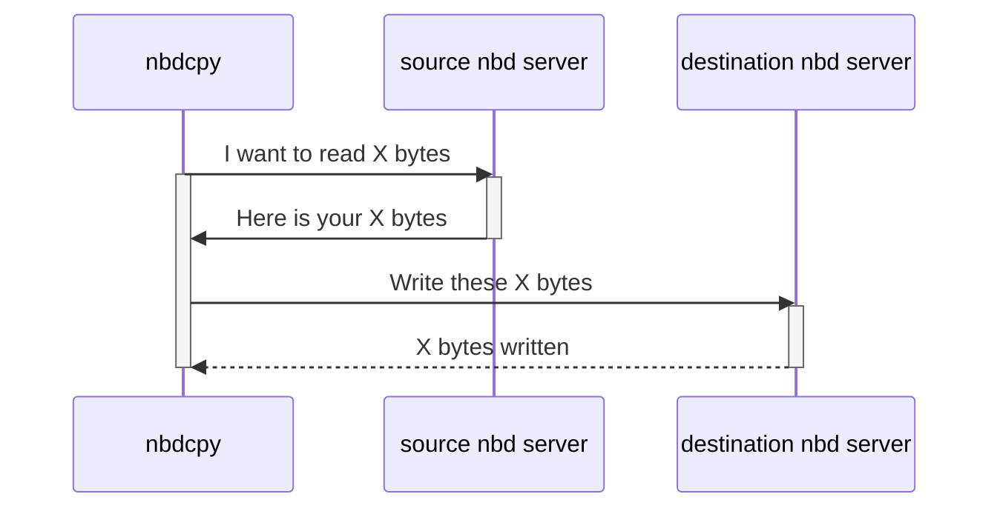
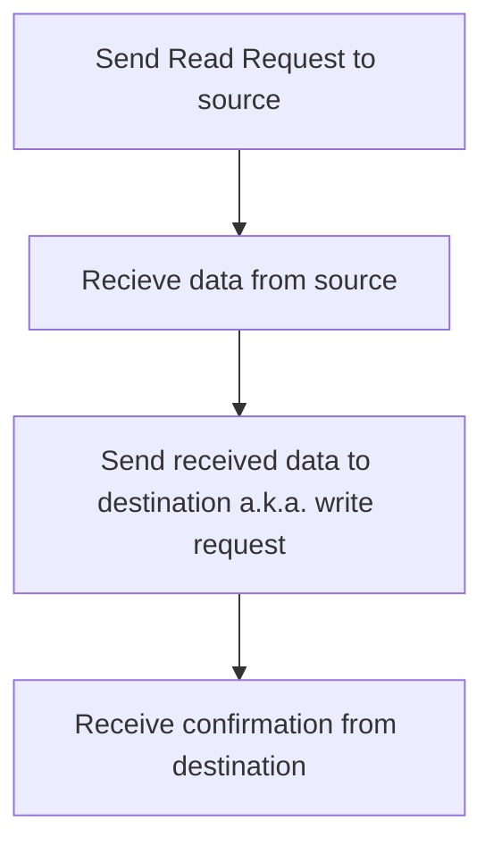
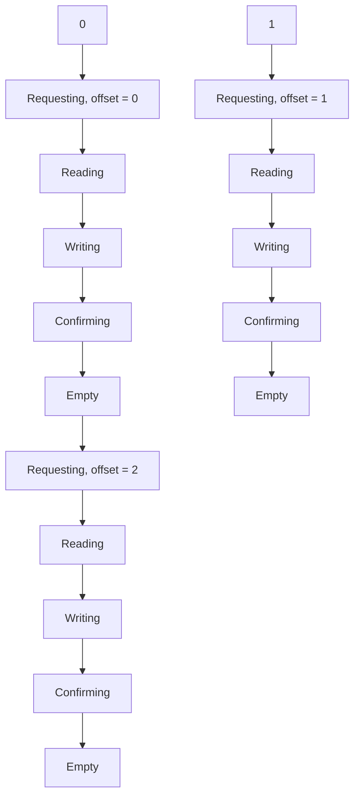
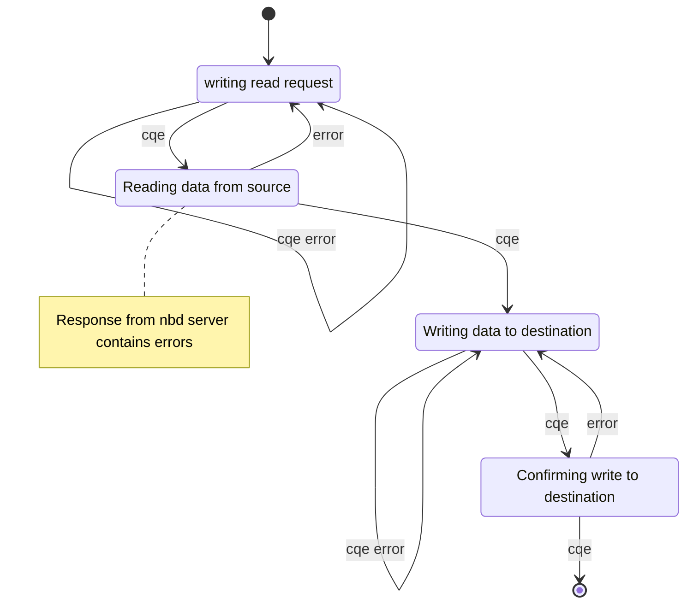

This document explains my current approach for using io_uring for nbdcpy a from-scratch tool to copy from one nbd server to another.

### Background

Some things I would like to highlight about NBD protocol before moving forward.

#### Typical copy operation

For copying a particular block this flow has to be followed.
By block I mean amount of data we want to read/write in one NBD request/packet(request_size) not TCP packet, one NBD packet might spread across multiple TCP packets.



##### nbdcpy's perspective

The work done by nbdcpy for a block has to strictly be in the order given below.



#### Handles

As you know `handle` is an arbitrary number in NBD protocol helps us determine for which request is the response to.

So if we send 2 read requests simultaneously (i.e. another request before reply of first is received)

First request

```yaml
offset: 0
length: 512
handle: 0
```

Second Request

```yaml
offset: 512
length: 512
handle: 1
```

First Received Response

```yaml
handle: 1
data: "Data bytes..."
```

Due to handle we know that it's actually the response to second request and we can then take appropriate action for the same. We can also reuse handles from the request that are fully complete.

**NOTE:** The handle need not be common between source and destination in context of nbdcpy but is easier to implement this way.

## Design and Implementation

We can have multiple nbd requests in flight (max: `max_inflights`).

```cpp
enum State {EMPTY, REQUESTING, READING, WRITING, CONFIRMING};

Struct NbdOperation {
	State state;
	u_int64_t offset;
	u_int32_t length;
}

vector<NbdOperation> operations;
```

The index of an operation will be used as `handle` for the command it houses. These handles will be reused once an operation is complete i.e. we went successfully through all the states of an operation.

In diagram below 0 and 1 are indexes in operation vector and total requests were 3 with `inflight_max = 2`.



Creating a UML state diagram for one request we get.



Events are `cqe` (we get a completion queue entry for a request we submit to iouring) we can attach some data with submission queue entry SQE which will be carried un-altered to cqe. I plan to store the handle which gives us access to the other data. We can add all required data to data and just use iouring and we will still be able to do everything, but I just realised this while writing and need to think about it more, IMO operations vector approach makes code more understandable and simpler.

Error events are `cqe error` and `error` later represents NBD error like invalid read/write.

# Technical Approach

I use uring instead of i`io_uring` because markdown uses `_` for italics and escaping is mouthful.

As explained earlier we get CQE after every event's completion. While it works fine for write/send on socket, on read we face problems, the root of the problem is Multiplexing.

See, NBD protocol author kept in mind that using one socket for one request at a time is wasting the socket so they added `handle` field in nbd request which is very similar to HTTP/2 stream ID which allows multiple requests over single TCP connection (NBD was first to do it).

When multiplexing, for uring it is easy to determine which write is completed. But when reading from a socket it is not possible for uring to determine which request was completed, it can only determine a read is available now it's up to our program to act accordingly.

### Before you async

A typical blocking send would look like

```cpp
RequestHeader rqh(...);
rqh.networkify();

send(fd, &rqh, sizeof(rqh), 0);
```

You can do this even in a function without worries because `rqh` and `&rqh` are still valid.

But in case of async I/O the operation is not guaranteed to be completed before calling function returns. and if the function returns &rqh would no longer be valid as it was on function's stack.

So we need to allocate it on the heap.

```cpp
RequestHeader *const rqh_ptr = new RequestHeader(...);
rqh_ptr->networkify();

async_send(fd, rqh_ptr, sizeof(*rqh_ptr), 0);
```

Now we have to free/delete the allocated memory.

### UringUserData

We get CQE from uring by

```cpp
io_uring_cqe* cqe = nullptr;

int ret = io_uring_wait_cqe(cqe);
```

cqe contains 3 fields `flags`, `res`, `user_data`

`flags` and `res` won't tell us which request does CQE belong to so we use the the third field `user_data` in which we can store anything(actually it's just pointer so not technically).

We store a struct `UringUserData`

`UringUserData` struct contains following fields.

```cpp
struct UringUserData{
	void* data;
	bool is_read;
}
```

**data**: Pointer to request (RequestHeader, SimplerReplyHeader) so that we can free it.

Now both of those contain handle which will help us get the index in operation vector which contains all the data we need.

**is_read**: To determine if socket operation was send(Read Request, Write Request) or recv(SimplerReplyHeader). This is required because write operations have one step in common, and read operations have one step in common.

#### Storing UringUserData

```cpp
io_uring_prep_send(sqe, ...);

UringUserData *uring_user_data = new UringUserData(request_ptr, true);
io_uring_sqe_set_data(sqe, uring_user_data);
```

Note that set data comes after `prep_send` this is because `prep_send` zeros user_data fields so it contains `nullptr` instead of some garbage.

#### Retrieving UringUserData

```cpp
io_uring_wait_cqe(cqe);

UringUserData *uring_user_data = (UringUserData *)io_uring_cqe_get_data(cqe);
// ... do the work
delete uring_user_data;
// free(uring_user_data); // if you use malloc
```
