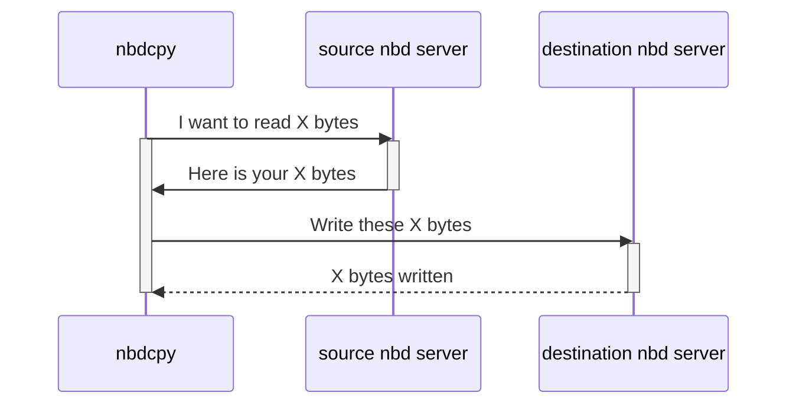
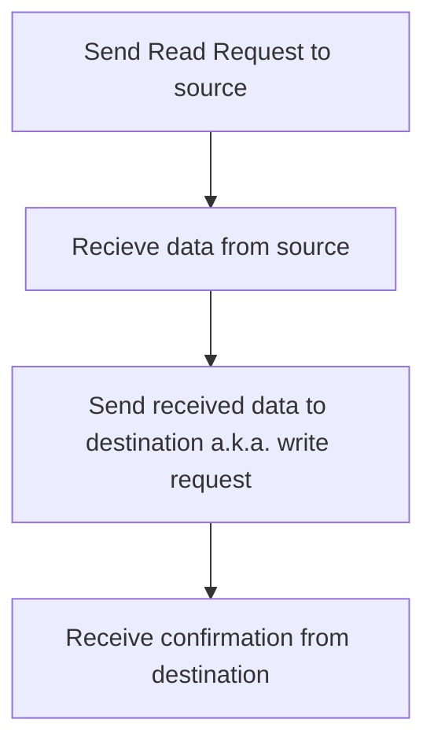
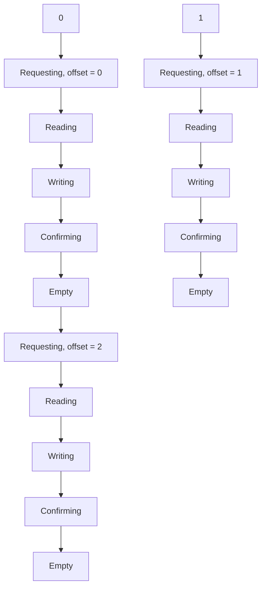
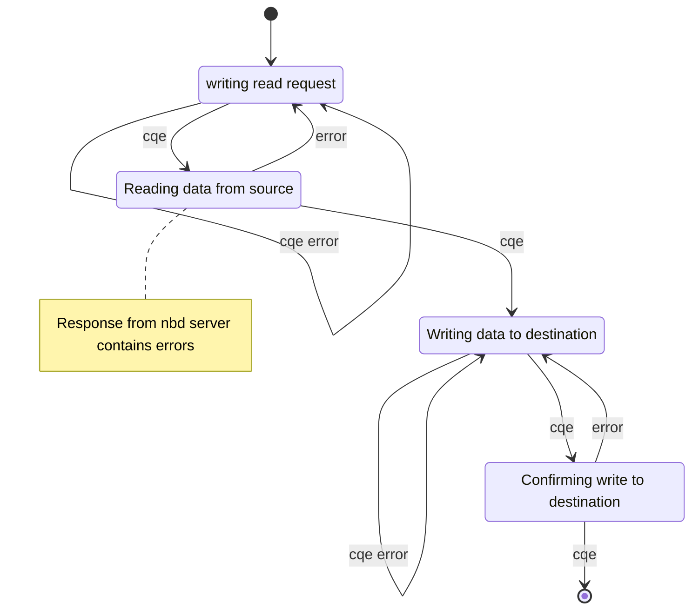

This document explains my current approach for using io_uring for nbdcpy a from-scratch tool to copy from one nbd server to another.

### Background

Some things I would like to highlight about NBD protocol before moving forward.

#### Typical copy operation

For copying a particular block this flow has to be followed.
By block I mean amount of data we want to read/write in one NBD request/packet(request_size) not TCP packet, one NBD packet might spread across multiple TCP packets.



##### nbdcpy's perspective

The work done by nbdcpy for a block has to strictly be in the order given below.



#### Handles

As you know `handle` is an arbitrary number in NBD protocol helps us determine for which request is the response to.

So if we send 2 read requests simultaneously (i.e. another request before reply of first is received)

First request

```yaml
offset: 0
length: 512
handle: 0
```

Second Request

```yaml
offset: 512
length: 512
handle: 1
```

First Received Response

```yaml
handle: 1
data: "Data bytes..."
```

Due to handle we know that it's actually the response to second request and we can then take appropriate action for the same. We can also reuse handles from the request that are fully complete.

**NOTE:** The handle need not be common between source and destination in context of nbdcpy but is easier to implement this way.

## Design and Implementation

We can have multiple nbd requests in flight (max: `max_inflights`).

```cpp
enum State {EMPTY, REQUESTING, READING, WRITING, CONFIRMING};

Struct NbdOperation {
	State state;
	u_int64_t offset;
	u_int32_t length;
}

vector<NbdOperation> operations;
```

The index of an operation will be used as `handle` for the command it houses. These handles will be reused once an operation is complete i.e. we went successfully through all the states of an operation.

In diagram below 0 and 1 are indexes in operation vector and total requests were 3 with `inflight_max = 2`.



Creating a UML state diagram for one request we get.



Events are `cqe` (we get a completion queue entry for a request we submit to iouring) we can attach some data with submission queue entry SQE which will be carried un-altered to cqe. I plan to store the handle which gives us access to the other data. We can add all required data to data and just use iouring and we will still be able to do everything, but I just realised this while writing and need to think about it more, IMO operations vector approach makes code more understandable and simpler.

Error events are `cqe error` and `error` later represents NBD error like invalid read/write.
